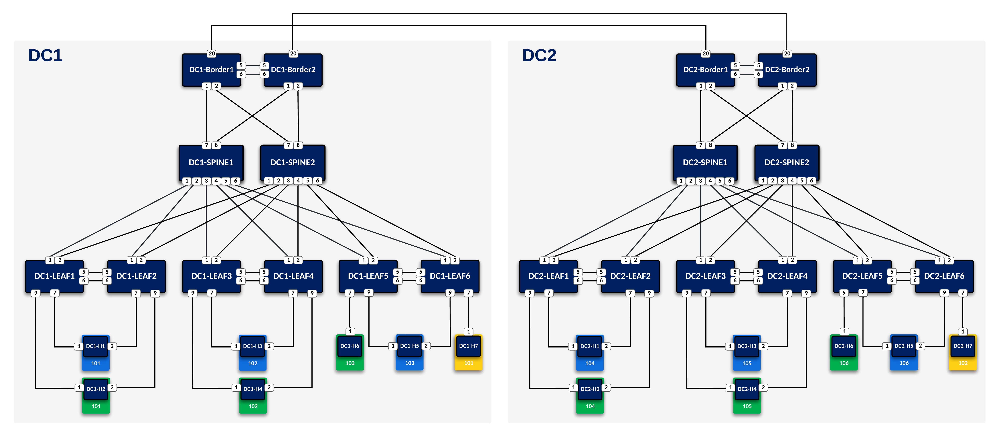
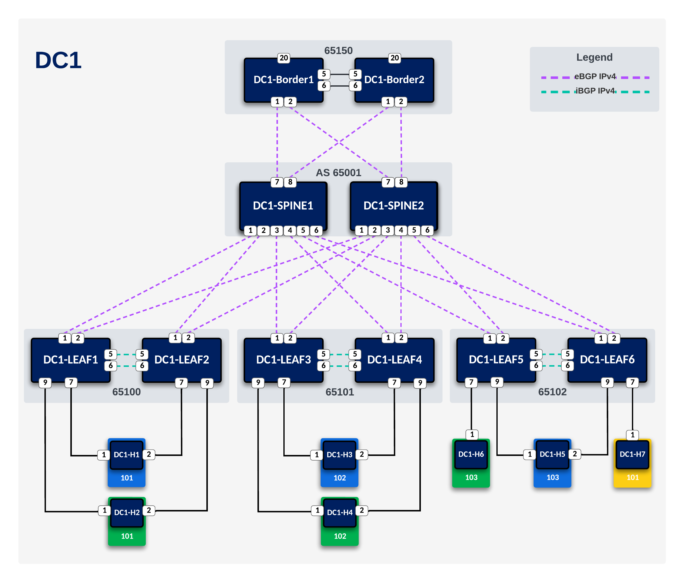
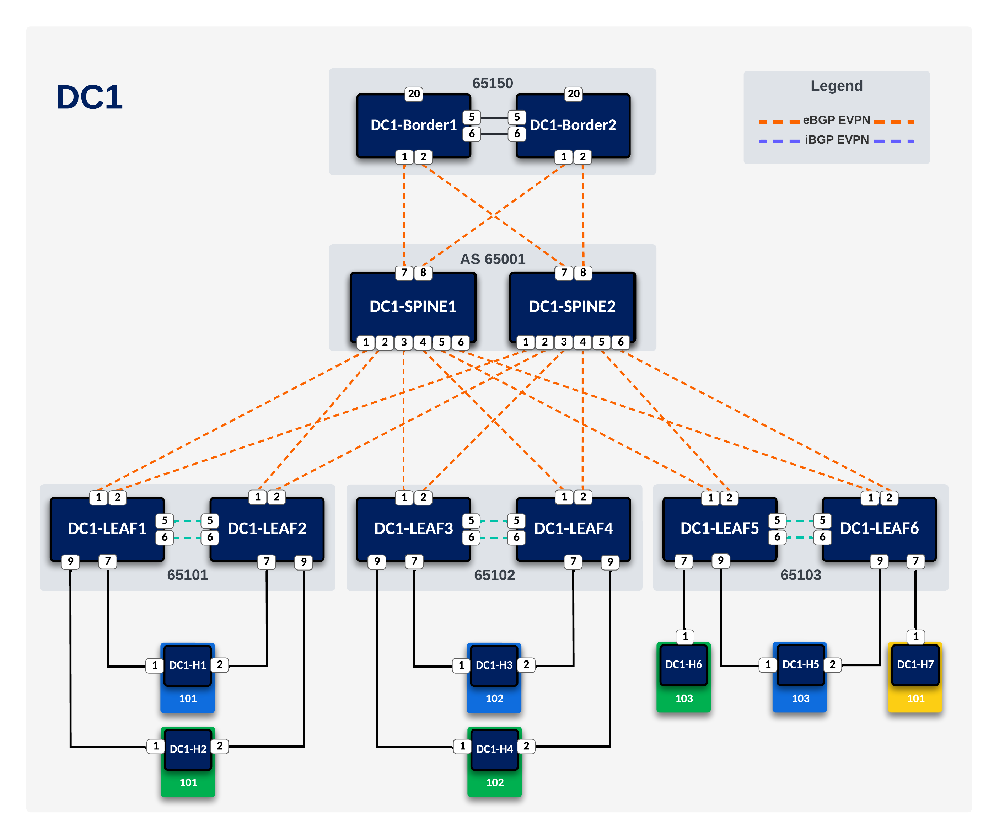
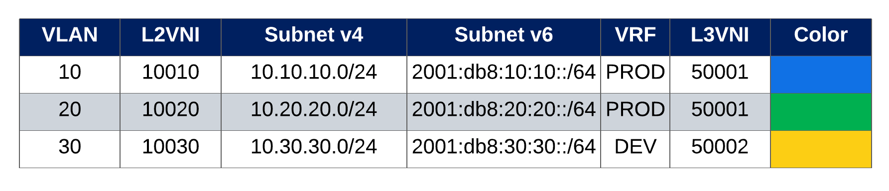

# L3LS DC Automation

This guide will go through the steps to fully configure a DC fabric from scratch using Infrastructure-as-Code
 - Ansible
 - Arista (AVD) 

### L3LS Topology

  

### Underlay

  

### Overlay

  

### Multi-Homing

  

### Tenant Networks

  

### Addressing

#### BGP AS Number

##### DC1

| Node | BGP AS |
|:---:|:---:|
| dc1-spine 1 | 65001 |
| dc1-spine 2 | 65001 |
| dc1-borderleaf 1 | 65150 |
| dc1-borderleaf 2 | 65150 |
| dc1-leaf 1 | 65100 |
| dc1-leaf 2 | 65100 |
| dc1-leaf 3 | 65101 |
| dc1-leaf 4 | 65101 |
| dc1-leaf 5 | 65102 |
| dc1-leaf 6 | 65102 |

##### DC2

| Node | BGP AS |
|:---:|:---:|
| dc2-spine 1 | 65002 |
| dc2-spine 2 | 65002 |
| dc2-borderleaf 1 | 65250 |
| dc2-borderleaf 2 | 65250 |
| dc2-leaf 1 | 65200 |
| dc2-leaf 2 | 65200 |
| dc2-leaf 3 | 65201 |
| dc2-leaf 4 | 65201 |
| dc2-leaf 5 | 65202 |
| dc2-leaf 6 | 65202 |

#### Loopbacks

##### DC1

| Node | Loopback 0 (L0) |
|:---:|:---:|
| dc1-leaf 1 | 192.168.101.1/32 |
| dc1-leaf 2 | 192.168.101.2/32|
| dc1-leaf 3 | 192.168.101.3/32|
| dc1-leaf 4 | 192.168.101.4/32|
| dc1-leaf 5 | 192.168.101.5/32|
| dc1-leaf 6 | 192.168.101.6/32|
| dc1-borderleaf 1 | 192.168.101.7/32| |
| dc1-borderleaf 2 | 192.168.101.8/32| |
| dc1-spine 1 | 192.168.101.9/32 |
| dc1-spine 2 | 192.168.101.10/32|

##### DC2

| Node | Loopback 0 (L0) |
|:---:|:---:|
| dc2-leaf 1 | 192.168.101.11/32 |
| dc2-lleaf 2 | 192.168.101.12/32 |
| dc2-lleaf 3 | 192.168.101.13/32 |
| dc2-lleaf 4 | 192.168.101.14/32 |
| dc2-lleaf 5 | 192.168.101.15/32 |
| dc2-lleaf 6 | 192.168.101.16/32 |
| dc2-lborderleaf 1 | 192.168.101.17/32 |
| dc2-lborderleaf 1 | 192.168.101.18/32 |
| dc2-lpine 1 | 192.168.101.19/32 |
| dc2-lspine 2 | 192.168.101.20/32 |

