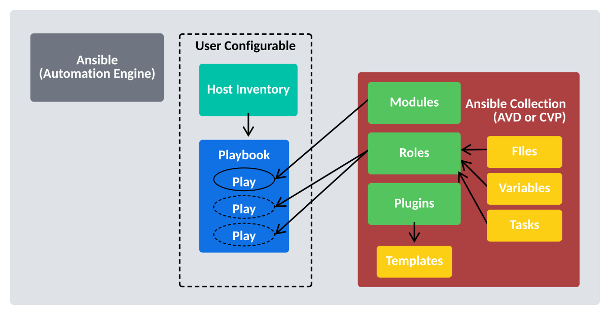

# Arista Automation Examples

What is the arista.avd collection?

Arista.avd is an Ansible collection for Arista AVD. It’s maintained by Arista and accepts third-party contributions on GitHub at aristanetworks/avd.

More details here:
<https://avd.arista.com/5.7/index.html>

While Ansible is the core automation engine, AVD is an Ansible Collection described above. It provides roles, modules, and plugins that allow the user to generate and deploy best-practice configurations to Arista based networks of various design types: Data Center, Campus and Wide Area Networks.

  

The illustration above shows the arista.avd collection as a box with a red background on the right-hand side.

When designing an EVPN/VXLAN L3LS fabric, you do not need to spend hours reading through the Arista Design and Deployment Guides. Instead, the AVD collection will implement those rules and guidelines.

AVD is an opinionated collection, meaning field experiences and best practices from actual deployments at Arista customers are included. With AVD, users get up and running quickly without inventing every part of the network configuration from scratch. This means the user must provide only the most basic information to get a new fabric up and running.

Parameters which need to be defined by the user include (but are not limited to):

- Username/password for network devices and CloudVision
- OOB management IP range
- IP scope for link addresses
- IP scope for loopback interfaces
- VLAN and VNI ranges
- Device hostnames
- Autonomous System numbers
- Interface connections between devices
- Which devices are acting in each role, such as spine or leaf.

From the details above, AVD will generate complete EOS configuration files that we can deploy to the devices. AVD also uses the information provided to produce full documentation of the current intended state of the network.
