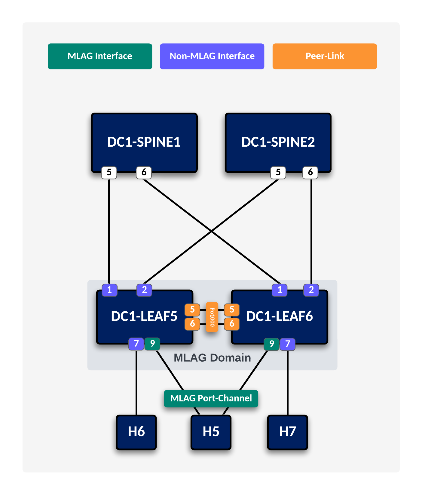

# L3LS DC Automation

This guide will go through the steps to fully configure a DC fabric from scratch using Infrastructure-as-Code
 - Ansible
 - Arista (AVD) 

### L3LS Topology

  

### Underlay

  

### Overlay

  

### Multi-Homing

  

### Tenant Networks

  

### Addressing

#### BGP AS Number

##### DC1

| Node | BGP AS |
|:---:|:---:|
| dc1-spine 1 | 65001 |
| dc1-spine 2 | 65001 |
| dc1-borderleaf 1 | 65150 |
| dc1-borderleaf 2 | 65150 |
| dc1-leaf 1 | 65100 |
| dc1-leaf 2 | 65100 |
| dc1-leaf 3 | 65101 |
| dc1-leaf 4 | 65101 |
| dc1-leaf 5 | 65102 |
| dc1-leaf 6 | 65102 |

##### DC2

| Node | BGP AS |
|:---:|:---:|
| dc2-spine 1 | 65002 |
| dc2-spine 2 | 65002 |
| dc2-borderleaf 1 | 65250 |
| dc2-borderleaf 2 | 65250 |
| dc2-leaf 1 | 65200 |
| dc2-leaf 2 | 65200 |
| dc2-leaf 3 | 65201 |
| dc2-leaf 4 | 65201 |
| dc2-leaf 5 | 65202 |
| dc2-leaf 6 | 65202 |

#### Loopbacks

##### DC1

| Node | Loopback 0 (L0) |
|:---:|:---:|
| dc1-leaf 1 | 192.168.101.1/32 |
| dc1-leaf 2 | 192.168.101.2/32|
| dc1-leaf 3 | 192.168.101.3/32|
| dc1-leaf 4 | 192.168.101.4/32|
| dc1-leaf 5 | 192.168.101.5/32|
| dc1-leaf 6 | 192.168.101.6/32|
| dc1-borderleaf 1 | 192.168.101.7/32| |
| dc1-borderleaf 2 | 192.168.101.8/32| |
| dc1-spine 1 | 192.168.101.9/32 |
| dc1-spine 2 | 192.168.101.10/32|

##### DC2

| Node | Loopback 0 (L0) |
|:---:|:---:|
| dc2-leaf 1 | 192.168.101.11/32 |
| dc2-lleaf 2 | 192.168.101.12/32 |
| dc2-lleaf 3 | 192.168.101.13/32 |
| dc2-lleaf 4 | 192.168.101.14/32 |
| dc2-lleaf 5 | 192.168.101.15/32 |
| dc2-lleaf 6 | 192.168.101.16/32 |
| dc2-lborderleaf 1 | 192.168.101.17/32 |
| dc2-lborderleaf 1 | 192.168.101.18/32 |
| dc2-lpine 1 | 192.168.101.19/32 |
| dc2-lspine 2 | 192.168.101.20/32 |

**Loopback 1 Addressing Table for MLAG Domains**

| Node | Loopback 1 (L1) |
|:---:|:---:|
| leaf 1 | 10.51.51.51/32 |
| leaf 2 | 10.51.51.51/32 |
| borderleaf 1 | 10.55.55.55/32 |
| borderleaf 2 | 10.55.55.55/32 |

**L3 Physical Links and IP Addresses**

| **Device** | **Local Interface** | **IP Address** | **AS Number** | **Neighbor Interface** |
|:---:|:---:|:---:|:---:|:---:|
| Border Leaf1 |  |  | 65500 |  |
|  | E1 |  |  | BL2 E1 |
|  | E2 |  |  | BL2 E2 |
|  | E3 | 10.10.5.1/30 |  | Spine1 E7 |
|  | E4 | 10.10.5.5/30 |  | Spine2 E7 |
|  | E5 | 10.10.5.9/30 |  | Spine3 E7 |
|  | E6 | 10.10.5.13/30 |  | Spine4 E7 |
| Border Leaf2 |  |  | 65500 |  |
|  | E1 |  |  | BL1 E1 |
|  | E2 |  |  | BL1 E2 |
|  | E3 | 10.10.6.1/30 |  | Spine1 E8 |
|  | E4 | 10.10.6.5/30 |  | Spine2 E8 |
|  | E5 | 10.10.6.9/30 |  | Spine3 E8 |
|  | E6 | 10.10.6.13/30 |  | Spine4 E8 |
| Spine 1 |  |  | 65100 |  |
|  | E1 |  |  | Spine2 E1 |
|  | E2 |  |  | Spine2 E2 |
|  | E3 | 10.10.1.1/30 |  | Leaf1 E3 |
|  | E4 | 10.10.1.5/30 |  | Leaf2 E3 |
|  | E5 | 10.10.1.9/30 |  | Leaf3 E3 |
|  | E6 | 10.10.1.13/30 |  | Leaf4 E3 |
|  | E7 | 10.10.5.2/30 |  | BL1 E3 |
|  | E8 | 10.10.6.2/30 |  | BL2 E3 |
| Spine 2 |  |  | 65100 |  |
|  | E1 |  |  | Spine1 E1 |
|  | E2 |  |  | Spine1 E2 |
|  | E3 | 10.10.2.1/30 |  | Leaf1 E4 |
|  | E4 | 10.10.2.5/30 |  | Leaf2 E4 |
|  | E5 | 10.10.2.9/30 |  | Leaf3 E4 |
|  | E6 | 10.10.2.13/30 |  | Leaf4 E4 |
|  | E7 | 10.10.5.6/30 |  | BL1 E4 |
|  | E8 | 10.10.6.6/30 |  | BL2 E4 |
| Spine 3 |  |  | 65100 |  |
|  | E1 |  |  | Spine4 E1 |
|  | E2 |  |  | Spine4 E2 |
|  | E3 | 10.10.3.1/30 |  | Leaf1 E5 |
|  | E4 | 10.10.3.5/30 |  | Leaf2 E5 |
|  | E5 | 10.10.3.9/30 |  | Leaf3 E5 |
|  | E6 | 10.10.3.13/30 |  | Leaf4 E5 |
|  | E7 | 10.10.5.10/30 |  | BL1 E5 |
|  | E8 | 10.10.6.10/30 |  | BL2 E5 |
| Spine 4 |  |  | 65100 |  |
|  | E1 |  |  | Spine3 E1 |
|  | E2 |  |  | Spine3 E2 |
|  | E3 | 10.10.4.1/30 |  | Leaf1 E6 |
|  | E4 | 10.10.4.5/30 |  | Leaf2 E6 |
|  | E5 | 10.10.4.9/30 |  | Leaf3 E6 |
|  | E6 | 10.10.4.13/30 |  | Leaf4 E6 |
|  | E7 | 10.10.5.14/30 |  | BL1 E6 |
|  | E8 | 10.10.6.14/30 |  | BL2 E6 |
| Leaf1 |  |  | 65001 |  |
|  | E1 |  |  | Leaf2 E1 |
|  | E2 |  |  | Leaf2 E2 |
|  | E3 | 10.10.1.2/30 |  | Spine1 E3 |
|  | E4 | 10.10.2.2/30 |  | Spine2 E3 |
|  | E5 | 10.10.3.2/30 |  | Spine3 E3 |
|  | E6 | 10.10.4.2/30 |  | Spine4 E3 |
| Leaf2 |  |  | 65001 |  |
|  | E1 |  |  | Leaf1 E1 |
|  | E2 |  |  | Leaf1 E2 |
|  | E3 | 10.10.1.6/30 |  | Spine1 E4 |
|  | E4 | 10.10.2.6/30 |  | Spine2 E4 |
|  | E5 | 10.10.3.6/30 |  | Spine3 E4 |
|  | E6 | 10.10.4.6/30 |  | Spine4 E4 |
| Leaf3 |  |  | 65002 |  |
|  | E1 |  |  | Leaf4 E1 |
|  | E2 |  |  | Leaf4 E2 |
|  | E3 | 10.10.1.10/30 |  | Spine1 E5 |
|  | E4 | 10.10.2.10/30 |  | Spine2 E5 |
|  | E5 | 10.10.3.10/30 |  | Spine3 E5 |
|  | E6 | 10.10.4.10/30 |  | Spine4 E5 |
| Leaf4 |  |  | 65003 |  |
|  | E1 |  |  | Leaf3 E1 |
|  | E2 |  |  | Leaf3 E2 |
|  | E3 | 10.10.1.14/30 |  | Spine1 E6 |
|  | E4 | 10.10.2.14/30 |  | Spine2 E6 |
|  | E5 | 10.10.3.14/30 |  | Spine3 E6 |
|  | E6 | 10.10.4.14/30 |  | Spine4 E6 |

**L3 EVPN Host Subnet IP Addresses and IP Gateways**

| Host | VLAN ID | SVI IP Address | Default Gateway |
|:---:|:---:|:---:|:---:|
| host 1 | 101 | 172.16.11.10/24 | 172.16.11.254/24 |
| host 2 | 201 | 172.16.21.20/24 | 172.16.21.254/24 |
| host 3 | 301 | 172.16.31.30/24 | 172.16.31.254/24 |
| host 4 | 401 | 172.16.41.40/24 | 172.16.41.254/24 |

**L3 EVPN Addressing Table for VLAN 101 on Leaf 1 and Leaf 2**

| VLAN 101 IP Anycast Gateway SVI | VLAN 101 SVI Leaf 1 IP | VLAN 101 Leaf 2 IP |
|:---:|:---:|:---:|
| 172.16.11.254/24 | 172.16.11.1/24 | 172.16.11.2/24 |

**Addressing Table for VLAN 201 subnet on Leaf 1 and Leaf 2**

| VLAN 201 IP Anycast Gateway SVI | VLAN 201 SVI Leaf 1 IP | VLAN 201 Leaf 2 IP |
|:---:|:---:|:---:|
| 172.16.21.254/24 | 172.16.21.1/24 | 172.16.21.2/24 |

**Addressing Table for VLAN 301 subnet on Leaf 3 and Leaf 4**

| VLAN 301 IP Anycast Gateway SVI | VLAN 301 SVI Leaf 3 IP | VLAN 301 Leaf 3 IP |
|:---:|:---:|:---:|
| 172.16.31.254/24 | 172.16.31.254/24 | 172.16.31.254/24 |

**Addressing Table for VLAN 401 subnet on Leaf 3 and Leaf 4**

| VLAN 401 IP Anycast Gateway SVI | VLAN 401 SVI Leaf 3 IP | VLAN 401 Leaf 4 IP |
|:---:|:---:|:---:|
| 172.16.41.254/24 | 172.16.41.254/24 | 172.16.41.254/24 |

**MLAG VLAN Addressing Table for MLAG Domain based on Leaf 1 and Leaf 2**

Domain ID: DomainLeaf1Leaf2

VLAN TRUNK GROUP: MLAGVLAN

Virtual Router MAC: 001c.7300.0099

| MLAG VLAN 4094 | leaf 1 SVI | leaf 2 SVI |
|:---:|:---:|:---:|
| MLAG VLAN 4094 | 172.16.40.1/30 | 172.16.40.2/30 |

**Addressing Table for VLAN 4093 subnet between Leaf 1 and Leaf 2**

| VLAN 4093 | VLAN 4093 SVI leaf 1 IP \| VLAN 4093 SVI leaf 2 IP |  |
|:---:|:---:|:---:|
|  | 172.16.4.1/30 | 172.16.4.2/30 |

**MLAG VLAN Addressing Table for MLAG Domain based on BorderLeaf 1 and BorderLeaf 2**

Domain ID: DomainBorderLeaf1BorderLeaf2

VLAN TRUNK GROUP: MLAGVLAN

Virtual Router MAC: 001c.7300.0098

| MLAG VLAN 4094 | Borderleaf 1 SVI | Borderleaf 2 SVI |
|:---:|:---:|:---:|
| MLAG VLAN 4094 | 172.16.60.1/30 | 172.16.60.2/30 |

**Addressing Table for VLAN 4093 subnet between BorderLeaf 1 and BorderLeaf 2**

| VLAN 4093 | VLAN 4093 SVI Borderleaf 1 IP | VLAN 4093 SVI Borderleaf 2 IP |
|:---:|:---:|:---:|
|  | 172.16.6.1/30 | 172.16.6.2/30 |

**L3 EVPN Addressing Table for VLAN 67 on BorderLeaf 1 and BorderLeaf 2**

| VLAN 67 IP Anycast Gateway SVI | VLAN 67 SVI BorderLeaf 1 IP | VLAN 67 BorderLeaf 2 IP |
|:---:|:---:|:---:|
| 67.76.96.254/24 | 67.76.96.1/24 | 67.76.96.2/24 |

**L2 and L3 VNI Mappings**

| MAC-VRF or IP-VRF | L2 VNI | L3 VNI |
|:---:|:---:|:---:|
| VLAN 101 | 1111 | 7777 |
| VLAN 201 | 2222 | 7777 |
| VLAN 301 | 3333 | 7777 |
| VLAN 401 | 4444 | 7777 |
| VLAN 67 | 6767 | 7777 |
| Tenant-C VRF-C |  | 7777 |

