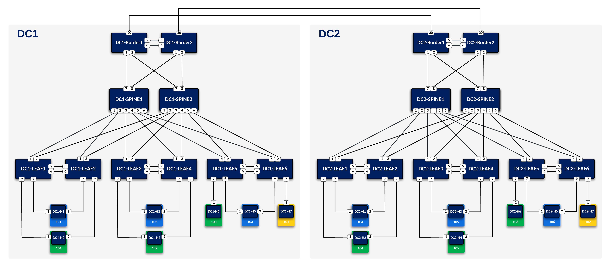
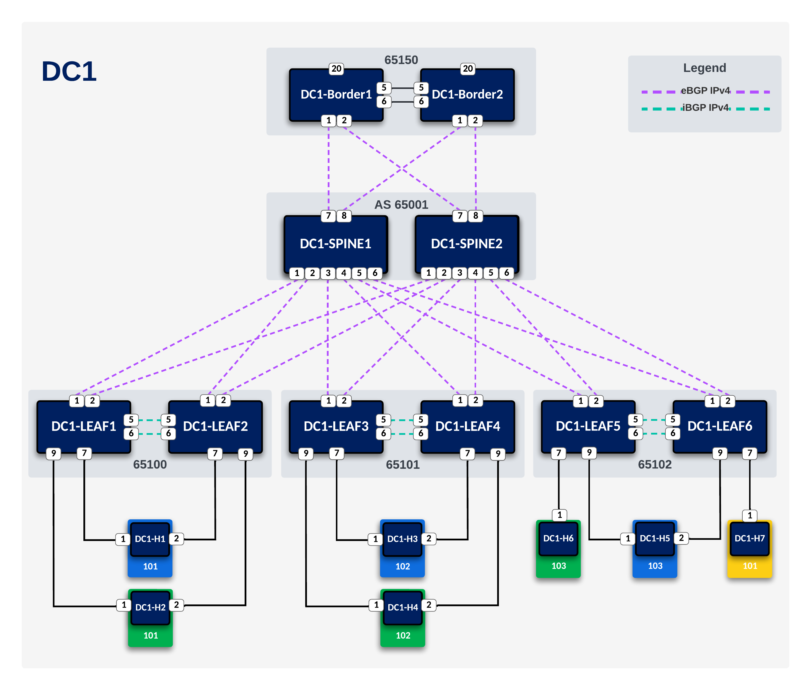
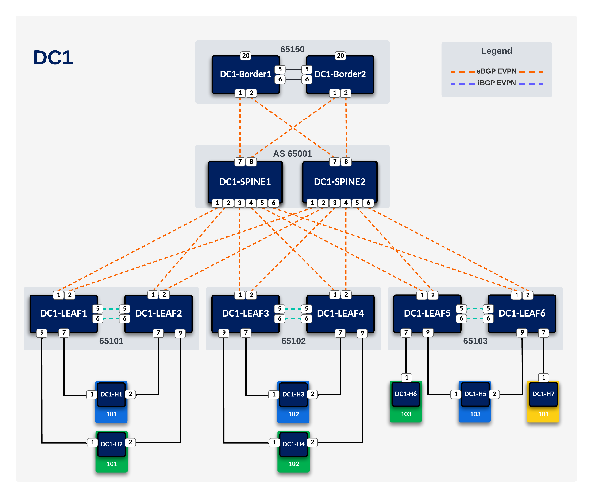
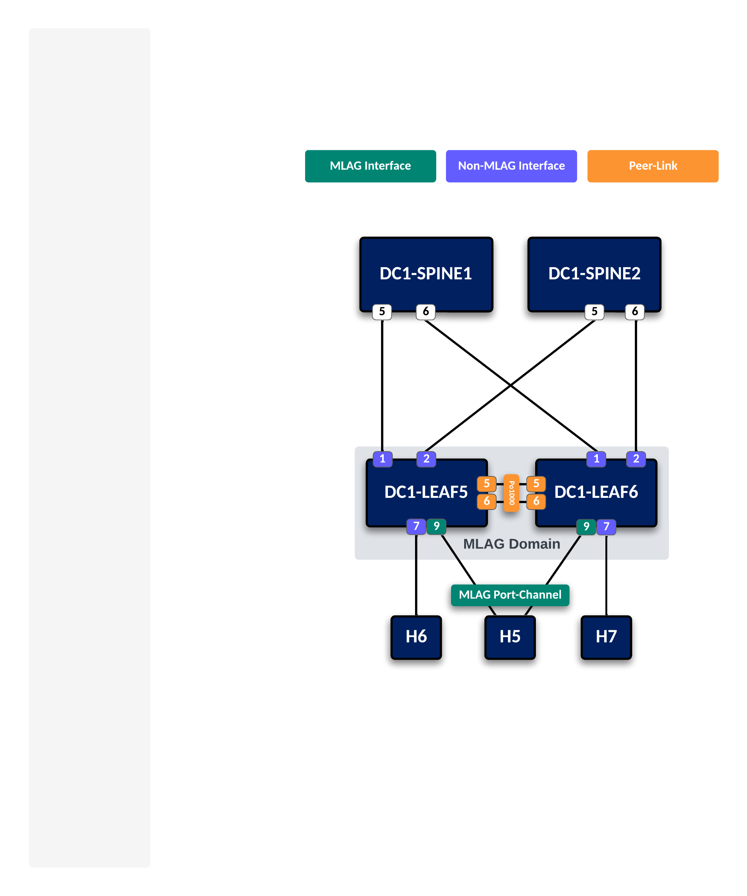
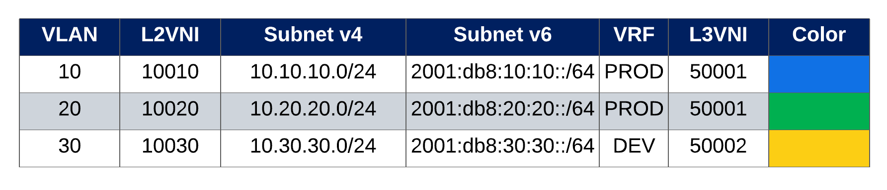

# L3LS-DC-AVD

This guide will go through the steps to fully configure a DC fabric from scratch using Infrastructure-as-Code
 - Ansible
 - Arista (AVD) 

L3LS Topology:

  

Underlay:

  

Overlay:

  

Multi-Homing:

  

Tenant Networks:

  

